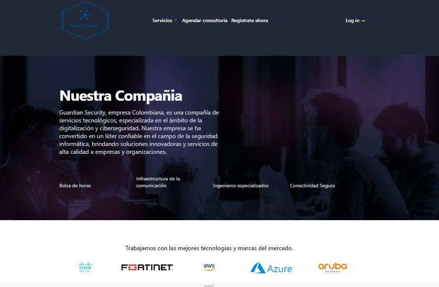
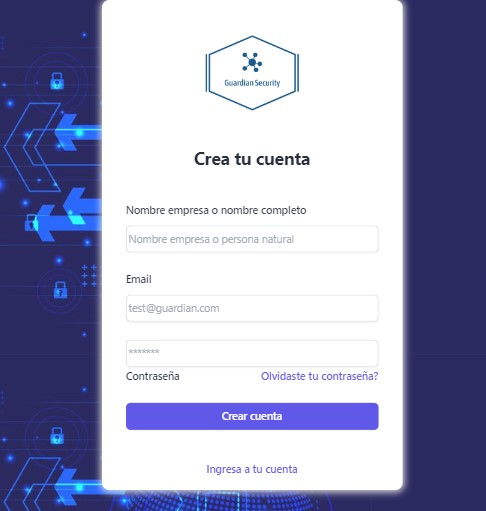
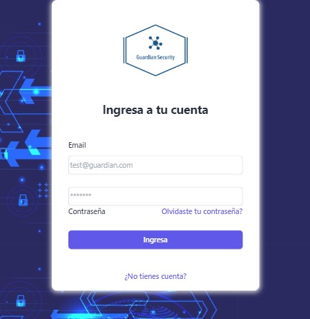
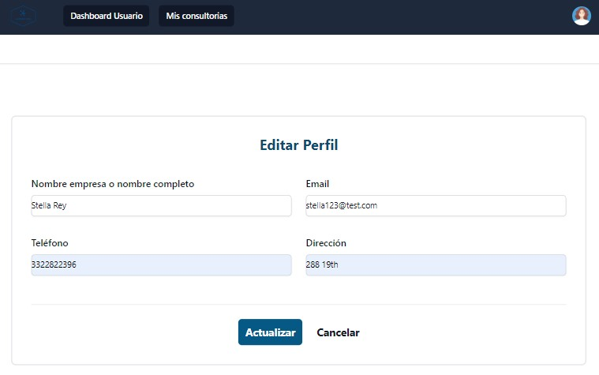
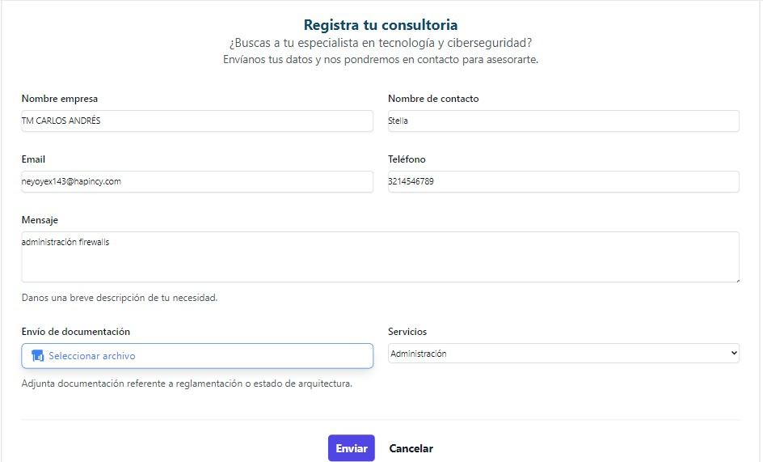
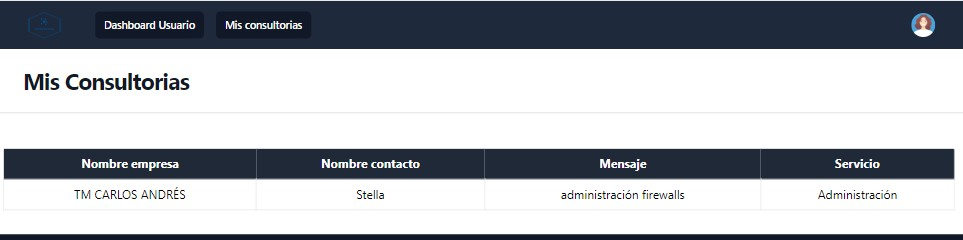

# Welcome to Project Go Cab Now 

It's a web app, oriented to provide consulting services for computer security in which you can consult the services offered by the company and also register requests according to the needs of customers.

## Table of Contents

- [Guardian Security Application Guide](#Guardian-Security-application-guide-)
  - [Table of Contents](#table-of-contents)
  - [Introduction](#introduction)
  - [Technologies Used](#technologies-used)
  - [Installation](#installation)
  - [Local development](#Local-development)
  - [Build with](#Build-with)
- [Features](#features)
  - [Homepage](#homepage)
  - [Registration and Authentication](#registration-and-authentication)
  - [User Profile](#user-profile)
  - [Create consulting](#create-consulting)
  - [My Consultings](#review-my-consulting)

## Introduction

Moteros is a web application oriented to provide consulting services for computer security in which you can consult the services offered by the company and also register requests according to the needs of customers.

## Technologies Used 📋

For development, you will only need:

- [Git](https://git-scm.com/downloads)
- [React](https://es.react.dev/)
- [NextJS](https://nextjs.org/)
- [Node.js](https://nodejs.org)

## Installation 🚀

These instructions will allow you to obtain a copy of the running project in your local machine, for the purpose of development and testing.

## 🔧 Install 

    $ git clone https://github.com/PVARGASM1/Guardian_Security_APP
    $ cd Guardin_Security_APP
    $ npm install
    
    Or you can use
    $ yarn

## 🛠️ Local development

    npm run dev
    Or you can use
    $ yarn dev

    Enter the address that the console returns, example: http://localhost:3000/

## Built with

- ReactJS + Vite
- Next JS
- Javascript
- TailwindCSS
- CSS

# Features

## Homepage

Welcome to our homepage

- **Homepage**
- 

## Registration and Authentication

If you want to have a create a consulting, you can register and authenticate:

- **Registration:** Create an account with your details.
- 

- **Login:** Sign in with your credentials.
- 

- **User Profile:** View and edit your profile information.
- 

- **Create Consulting:** Register a new consulting.
- 

- **My Consultings:** Review my consultings created.
- 

## 👥 Contributions 🛠️

- Andrea Vargas- Developer - (https://github.com/PVARGASM1)

## Acknowledgements 🎁

I would really like to thank the Make it Real team for providing the tools for building my individual project. 
